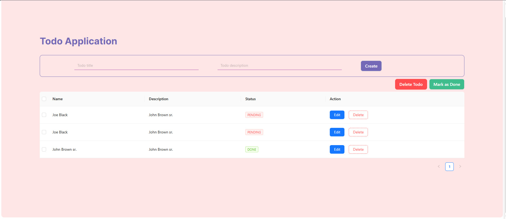
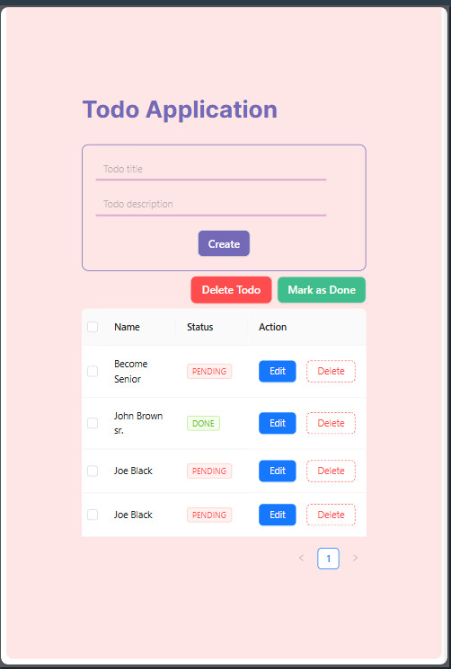
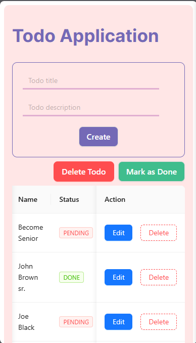

## Available Scripts to run this application

In the project directory, you can run:

### `yarn install`

then run

### `yarn dev`

Runs the app in the development mode.\
Open [http://localhost:3000](http://localhost:3000) to view it in your browser.

## Preview

# PC

# Tablet

# Mobile

